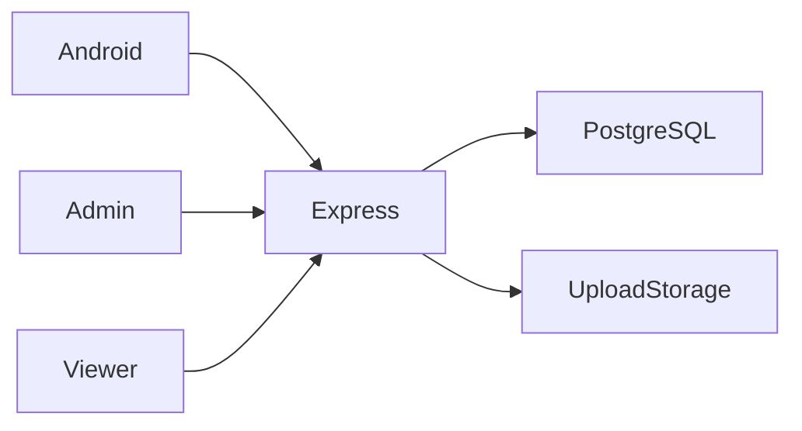

# IQBox

**تطبيق أندرويد لمشاركة الملفات والفيديو مع لوحة إدارة**

[English](README.md)

رفع الملفات والفيديو ومشاركتها من أندرويد، مع صفحات مشاركة عامة ولوحة إدارة للحسابات والتخزين والتحكم بالمشاركة.

**التقنيات:** Kotlin · Jetpack Compose · Express · PostgreSQL · React · PHP

## الحالة والتاريخ

نُشر واختُبر سابقاً. يبين المصدر انتقاله من الفيديو إلى الملفات والمجلدات؛ لا تُذكر أرقام إيرادات أو جمهور غير موثقة.

هذه نسخة عرض منقحة للنشر. تعرض [وثيقة التحقق](docs/verification.ar.md) الفحوص الحالية بصورة مستقلة عن النشر السابق.

## الوظائف والإجراءات

- مصادقة JWT ورفع الفيديو والملفات وحدود التخزين
- ملكية خاصة وروابط مشاركة عامة للملفات والمجلدات
- بث وتنزيل وروابط عميقة لأندرويد
- تقدم الرفع في الخلفية والإشعارات
- بوابات إعلانية ومشاهدات واشتراكات وإحالات وسجل محفظة وسحب
- إدارة React وإعدادات تطبيق ديناميكية

رفع من أندرويد بعد الدخول ← حفظ الملف وبياناته في الخادم ← إنشاء رمز مشاركة ← عرض عام وبوابة الإعلان ← بث أو تنزيل؛ تدير اللوحة المنصة.

## البنية

## القرارات الهندسية

- يحفظ PostgreSQL البيانات الوصفية والسجلات التجارية وتبقى الملفات في نظام الملفات؛ يجب نسخ الاثنين احتياطياً.
- تسمح رموز المشاركة بالوصول العام دون منح صلاحيات تعديل المالك.
- صفحة العرض المعتمدة هي `video-page/`؛ استُبعدت النسخة التاريخية المكررة. ملف `routes/sharing.js` غير مربوط في `server.js`.
- أصبح التشغيل التطويري يستخدم Node watch بدلاً من nodemon غير المصرح به، وحُذفت مسارات الإدارة المكررة.
- تُرفض امتدادات التنفيذ ويجب أن يجتاز الفيديو فحص الامتداد وMIME معاً. هذا ليس فحصاً للبرمجيات الضارة.

## المجلدات

| المكون | المسؤولية |
|---|---|
| `IQBox-Android/` | تطبيق أندرويد Compose |
| `routes/` | واجهات المصادقة والرفع والمشاركة وبوابات الإعلان والحسابات المالية |
| `config/` | اتصال PostgreSQL وتهيئة الجداول |
| `admin-panel/` | إدارة React |
| `video-page/` | عارض المشاركة العام PHP |

## التثبيت والإعداد

أنشئ قاعدة PostgreSQL والمستخدم وانسخ `env.example` إلى `.env` مع مفتاح JWT جديد، ثم ثبّت وشغّل الخادم. يتم تهيئة الجداول عند البداية. شغّل لوحة `admin-panel/` وصفحات PHP في `video-page/`. افتح مشروع أندرويد باستخدام JDK 17 وSDK 34 وحدد `IQBOX_API_BASE_URL` مع شرطة مائلة أخيرة؛ العنوان الافتراضي مناسب للمحاكي.

توجد أوامر التشغيل ومتغيرات البيئة في [دليل الإعداد](docs/setup.ar.md). القيم أمثلة محلية أو حقول فارغة؛ لا تعِد استخدام بيانات إنتاج سابقة.

## العرض والتحقق

رفع من أندرويد بعد الدخول ← حفظ الملف وبياناته في الخادم ← إنشاء رمز مشاركة ← عرض عام وبوابة الإعلان ← بث أو تنزيل؛ تدير اللوحة المنصة.

استخدم حسابات وسجلات اصطناعية. راجع [خطوات العرض](docs/demo.ar.md) وسجل نتائج الفحوص الحالية. نجاح بناء مكون لا يثبت نجاح كل مسارات المنتج.

## الحدود

يلزم فحص بناء أندرويد والرفع الخلفي والروابط العميقة واحتساب المشاهدات المتكررة وكل حالات السحب والدفع. الإعلانات والدفع اعتماديات خارجية وليست دليلاً على دخل.

## التوثيق

- [البنية](docs/architecture.ar.md)
- [الإعداد](docs/setup.ar.md)
- [العرض](docs/demo.ar.md)
- [المسارات](docs/api.ar.md)
- [الفحوص الحالية](docs/verification.ar.md)
- [النشر وحل المشكلات](docs/deployment.ar.md)
- [حقوق الأصول](THIRD_PARTY_NOTICES.md)

## المساهمة والترخيص

افتح مشكلة تتضمن خطوات إعادة الإنتاج والمكون المعني. استخدم بيانات اصطناعية وتعديلات مركزة وفحوصاً مناسبة، ولا ترسل أسراراً أو سجلات مستخدمين خاصة. الشيفرة بترخيص [MIT](LICENSE)، وتحتفظ الاعتماديات والأصول الخارجية بشروطها الأصلية.

<!-- release-presentation -->

## من التطبيق الفعلي

هذه لقطة فعلية للواجهة المحلية، وليست دليلاً على استخدام إنتاجي أو فحص أندرويد.

## التحقق والقراءة المتعمقة

نجح تشغيل API وبناء الإدارة على PostgreSQL تجريبية جديدة. نجحت فحوص فصل رموز المستخدم والمدير ورفض مجلد مستخدم آخر ورفع نص مولد ورابط المشاركة ورفض رمز غير صالح وحذف غير مصرح ورفع ملف قابل للتنفيذ وتجاوز الحصة. نجح تحميل لوحة الإدارة وفتح رابط المشاركة المولد في عارض PHP المحلي. تبقى روابط المتاجر مخفية حتى إعدادها. أُصلح الوصول لقيم إحصائية غير مهيأة أثناء التحميل الأول.

يلزم فحص بناء أندرويد والرفع الخلفي والروابط العميقة واحتساب المشاهدات المتكررة وكل حالات السحب والدفع. الإعلانات والدفع اعتماديات خارجية وليست دليلاً على دخل.

- [دراسة المشروع](docs/case-study.ar.md)
- [التحقق](docs/verification.ar.md)
- [مخطط البنية](docs/architecture.svg)
- [صفحة المشروع](https://mohamed-abderrehmane-portfolio.hillock-factual9mupt.chatgpt.site/ar/projects/iqbox/)

- [جولة الواجهة والفيديو](docs/walkthrough.ar.md)

- [تفاصيل هندسية ودروس التنفيذ](docs/engineering-notes.ar.md)
