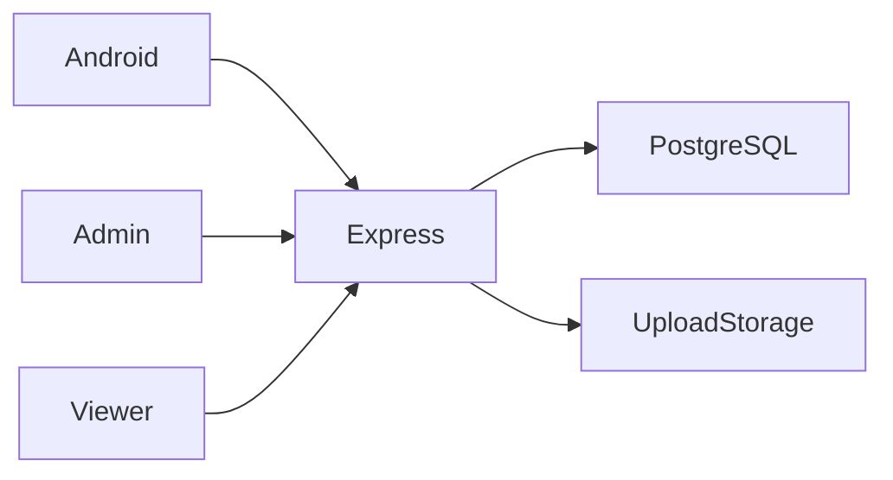

# IQBox

**Android file and video sharing**

[العربية](README.ar.md)

Give Android users an upload and sharing workflow while providing public viewers and administrative control.

**Technology:** Kotlin · Jetpack Compose · Express · PostgreSQL · React · PHP

## Status and deployment history

Previously deployed and tested. The source shows an evolution from videos to general files and folders; no revenue or audience figures are asserted.

This is a sanitized portfolio release. See the current [verification record](docs/verification.md) before choosing a runtime demonstration.

## Main workflows and implemented features

- JWT authentication, video/file uploads and storage quotas
- Private ownership and public file/folder sharing
- Streaming, downloads and Android deep links
- Background upload progress and notifications
- Ad gates, views, subscriptions, referrals, wallet and withdrawal records
- React administration and dynamic application settings

Authenticated Android upload → API stores bytes and metadata → owner creates a sharing token → public viewer handles its gate → recipient streams or downloads; administrator manages the platform.

## Architecture

## Engineering decisions

- PostgreSQL stores metadata and business records; uploaded bytes stay in filesystem storage. Backups must cover both.
- Sharing tokens grant public access independently from owner-only mutation rights. A valid token does not grant deletion permission.
- The maintained web viewer is `video-page/`; the duplicate historical `iqbox-video/` copy is excluded. `routes/sharing.js` exists but is not mounted in `server.js`.
- The development command uses Node watch mode instead of undeclared nodemon. Duplicate legacy admin settings/stats registrations were removed.
- Executable upload extensions are rejected and video extension and MIME checks must both pass. This is not malware scanning.

## Directory guide

| Component | Responsibility |
|---|---|
| `IQBox-Android/` | Compose Android application |
| `routes/` | Authentication, uploads, shares, gates and finance API |
| `config/` | PostgreSQL connection and initialization |
| `admin-panel/` | React administration |
| `video-page/` | PHP public sharing viewer |

## Installation

Create PostgreSQL database/user from `env.example`; copy it to `.env`, generate a JWT secret and install with `npm ci`. Run `npm run dev`; database initialization occurs at startup. In `admin-panel/`, install and run `npm run dev`. Serve `video-page/` through PHP with its API and site URL configuration. Open `IQBox-Android/` in Android Studio with JDK 17 and SDK 34. Set the Gradle property `IQBOX_API_BASE_URL` with a trailing slash; the emulator default is `http://10.0.2.2:3000/api/`.

All required/private configuration is described in [setup](docs/setup.md). Examples contain placeholders or local demo values. Never reuse historical credentials.

## Demonstration

- Register two synthetic accounts and upload harmless sample text/video.
- Share a file and folder; open the public viewer, then test Android deep-link handling.
- Attempt cross-user deletion and folder access; exceed a small demo quota and inspect cleanup.
- Inspect view, wallet and withdrawal records without connecting payment/ad providers.

## Verification and limitations

- Node syntax and route registration checks
- Unauthorized mutations and sharing-token rejection
- Quota rejection and failed-upload cleanup
- Android and viewer integration need separate runtime verification

External ad/payment integrations require provider configuration. Wallet records do not prove completed payouts. Storage cleanup, repeated view events and financial state transitions need database integration checks.

## Documentation

- [Architecture](docs/architecture.md) · [العربية](docs/architecture.ar.md)
- [Setup and configuration](docs/setup.md) · [العربية](docs/setup.ar.md)
- [Demo walkthrough](docs/demo.md) · [العربية](docs/demo.ar.md)
- [API and execution paths](docs/api.md)
- [Verification record](docs/verification.md)
- [Deployment and troubleshooting](docs/deployment.md)
- [Asset attribution](THIRD_PARTY_NOTICES.md) · [MIT license](LICENSE)

## Contributing

Open an issue describing a reproducible problem, expected behavior and component involved. Use synthetic data. Keep changes focused and include relevant checks. Do not include credentials or private user records.

## License and attribution

Source code is MIT licensed. Third-party dependencies and assets retain their own terms; see [attribution](THIRD_PARTY_NOTICES.md).

<!-- release-presentation -->

## Actual application interface

Captured from the local application with synthetic records. This does not establish production usage or Android device verification.

## Verification and deeper reading

API startup and admin production build passed on a fresh PostgreSQL demo database. HTTP checks passed user/admin token separation, foreign folder rejection, generated text upload, public share lookup, invalid token rejection, unauthorized deletion rejection, executable upload rejection, and quota enforcement. Browser verification passed the administration loading state and opened the generated share link in the local PHP viewer. Optional store links stay hidden until configured. A null statistics reference during initial loading was corrected.

Android builds/background transfers/deep links, repeated-view accounting and complete withdrawal/payment state transitions need separate verification. External advertisements and payment processing are dependencies, not demonstrated income.

- [Case study](docs/case-study.md)
- [Verification](docs/verification.md)
- [Architecture diagram](docs/architecture.svg)
- [Portfolio case study](https://mohamed-abderrehmane-portfolio.hillock-factual9mupt.chatgpt.site/projects/iqbox/)

- [Interface walkthrough and video](docs/walkthrough.md)
