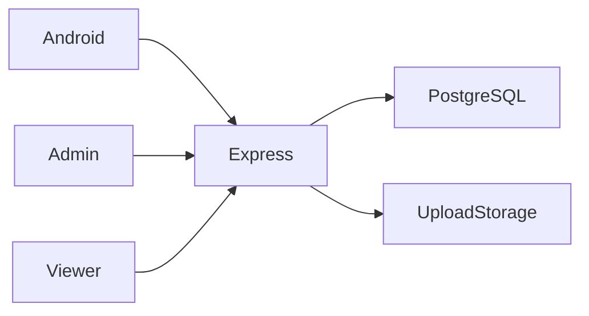

# بنية IQBox

رفع من أندرويد بعد الدخول ← حفظ الملف وبياناته في الخادم ← إنشاء رمز مشاركة ← عرض عام وبوابة الإعلان ← بث أو تنزيل؛ تدير اللوحة المنصة.

## القرارات والمفاضلات

- يحفظ PostgreSQL البيانات الوصفية والسجلات التجارية وتبقى الملفات في نظام الملفات؛ يجب نسخ الاثنين احتياطياً.
- تسمح رموز المشاركة بالوصول العام دون منح صلاحيات تعديل المالك.
- صفحة العرض المعتمدة هي `video-page/`؛ استُبعدت النسخة التاريخية المكررة. ملف `routes/sharing.js` غير مربوط في `server.js`.
- أصبح التشغيل التطويري يستخدم Node watch بدلاً من nodemon غير المصرح به، وحُذفت مسارات الإدارة المكررة.
- تُرفض امتدادات التنفيذ ويجب أن يجتاز الفيديو فحص الامتداد وMIME معاً. هذا ليس فحصاً للبرمجيات الضارة.

## مراجع الشيفرة

- [server.js](../server.js)
- [routes/files.js](../routes/files.js)
- [routes/folders.js](../routes/folders.js)
- [routes/admin.js](../routes/admin.js)
- [middleware/upload.js](../middleware/upload.js)
- [IQBox-Android/app/src/main/java/com/iqbox/app/data/api/ApiClient.kt](../IQBox-Android/app/src/main/java/com/iqbox/app/data/api/ApiClient.kt)

## الحدود

تحتاج الإعلانات والمدفوعات مزودين خارجيين. سجلات المحفظة لا تثبت تحويل الأموال. يلزم فحص قاعدة بيانات للتنظيف والمشاهدات والحالات المالية.
