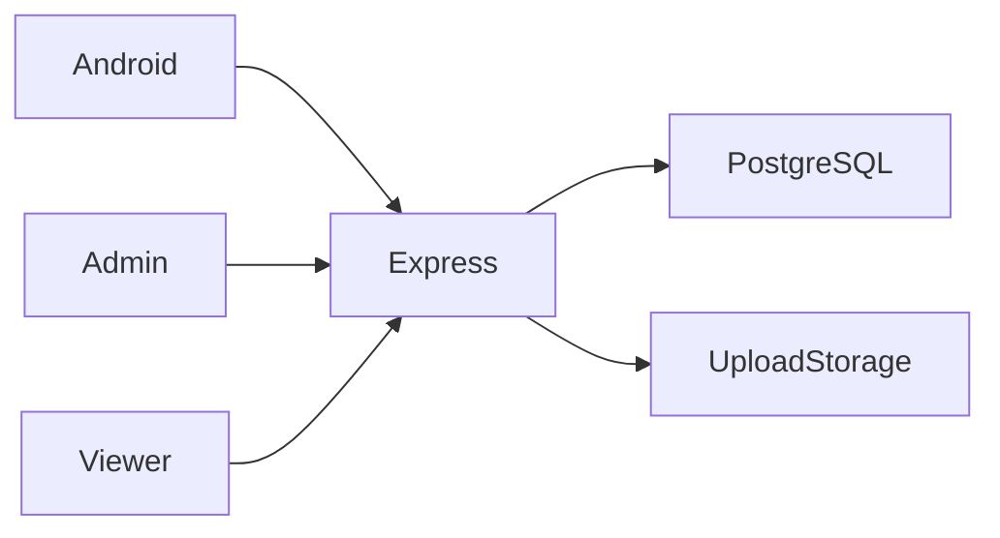

# IQBox architecture

Authenticated Android upload → API stores bytes and metadata → owner creates a sharing token → public viewer handles its gate → recipient streams or downloads; administrator manages the platform.

## Decisions and tradeoffs

- PostgreSQL stores metadata and business records; uploaded bytes stay in filesystem storage. Backups must cover both.
- Sharing tokens grant public access independently from owner-only mutation rights. A valid token does not grant deletion permission.
- The maintained web viewer is `video-page/`; the duplicate historical `iqbox-video/` copy is excluded. `routes/sharing.js` exists but is not mounted in `server.js`.
- The development command uses Node watch mode instead of undeclared nodemon. Duplicate legacy admin settings/stats registrations were removed.
- Executable upload extensions are rejected and video extension and MIME checks must both pass. This is not malware scanning.

## Component boundaries

| Component | Responsibility |
|---|---|
| `IQBox-Android/` | Compose Android application |
| `routes/` | Authentication, uploads, shares, gates and finance API |
| `config/` | PostgreSQL connection and initialization |
| `admin-panel/` | React administration |
| `video-page/` | PHP public sharing viewer |

## Source evidence

- [server.js](../server.js)
- [routes/files.js](../routes/files.js)
- [routes/folders.js](../routes/folders.js)
- [routes/admin.js](../routes/admin.js)
- [middleware/upload.js](../middleware/upload.js)
- [IQBox-Android/app/src/main/java/com/iqbox/app/data/api/ApiClient.kt](../IQBox-Android/app/src/main/java/com/iqbox/app/data/api/ApiClient.kt)

## Limits

External ad/payment integrations require provider configuration. Wallet records do not prove completed payouts. Storage cleanup, repeated view events and financial state transitions need database integration checks.
